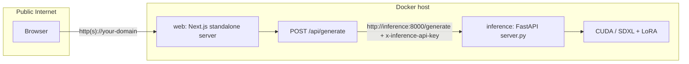

# Architecture

This app has one generation backend: a self-hosted FastAPI server running SDXL on a GPU.

## Docker Request Flow



Public users reach only the `web` service. The `inference` service is internal to Docker Compose and protected with `INFERENCE_API_KEY` for accidental exposure scenarios.

## Runtime Services

| Service | Role |
| --- | --- |
| `web` | Serves the Next.js UI and `/api/generate`; exposed on `3000:3000`. |
| `inference` | Runs FastAPI, SDXL, and LoRA generation on a CUDA GPU; internal port `8000`. |
| `hf-cache` | Docker volume mounted at `/models/huggingface` to avoid redownloading model weights. |

## Code Map

| Path | Role |
| --- | --- |
| `app/api/generate/route.ts` | Public app API route, env validation, and user-facing error hints. |
| `lib/generate-comparison/self-hosted.ts` | Sends generation JSON and `x-inference-api-key` to the GPU service. |
| `self-hosted-inference/server.py` | FastAPI service; `/health` is public and `/generate` can require `INFERENCE_API_KEY`. |
| `Dockerfile` | Production Next.js standalone image. |
| `self-hosted-inference/Dockerfile` | CUDA/PyTorch inference image. |
| `docker-compose.yml` | Two-service public deployment for a GPU host. |

## Environment Contract

For Docker, `.env.docker` supplies:

```env
LORA_WEIGHTS_URL=https://huggingface.co/you/repo/resolve/main/your-lora.safetensors
INFERENCE_API_KEY=replace-with-a-long-random-secret
HF_TOKEN=
SDXL_MODEL_ID=stabilityai/stable-diffusion-xl-base-1.0
```

`docker-compose.yml` sets `INFERENCE_API_URL=http://inference:8000` for the web container. In non-Docker deployments, set `INFERENCE_API_URL` yourself.

## JSON Contract

Next.js sends this body to the FastAPI server:

```json
{
  "baseline_prompt": "a portrait of a CEO",
  "diverse_prompt": "a portrait of a CEO, div_rep",
  "num_inference_steps": 30,
  "guidance_scale": 7.5,
  "seed": 123,
  "lora_scale": 0.8,
  "lora_weights_url": "https://huggingface.co/you/repo/resolve/main/model.safetensors"
}
```

When `INFERENCE_API_KEY` is set, Next.js also sends:

```txt
x-inference-api-key: <shared secret>
```

The FastAPI server returns:

```json
{
  "baseline_image_b64": "...",
  "diverse_image_b64": "...",
  "mime_type": "image/png"
}
```

## Public Hosting Notes

Run this stack on a GPU host with NVIDIA Container Toolkit. Put a reverse proxy or managed load balancer in front of the `web` container for TLS and public traffic. Keep `inference` private to the Docker network whenever possible.
