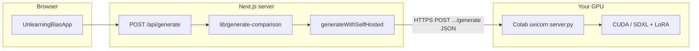

# Architecture (Colab-first branch)

This branch treats **Google Colab + ngrok + FastAPI** as the primary inference path. **Replicate** and **SageMaker** are optional alternatives.

## Request flow (primary: Colab)

1. **UI** (`components/UnlearningBiasApp.tsx`) calls `POST /api/generate` with prompt and hyperparameters.
2. **`app/api/generate/route.ts`** builds `ComparisonRequest`, requires `LORA_WEIGHTS_URL`, calls `generateComparison()`.
3. **`lib/generate-comparison/index.ts`** picks a backend via `resolveBackendMode()` (see below), then calls `generateWithSelfHosted`, `generateWithReplicate`, or `generateWithSageMaker`.
4. **Self-hosted path** (`lib/generate-comparison/self-hosted.ts`) POSTs JSON to `${INFERENCE_API_URL}/generate`.
5. **Colab** runs `self-hosted-inference/server.py` (FastAPI): loads SDXL, downloads LoRA from the URL in the body, returns two base64 PNGs in JSON.

## Directory map

| Path | Role |
|------|------|
| `app/api/generate/route.ts` | HTTP API, env validation, error hints |
| `lib/generate-comparison/` | Backend switch + Replicate / SageMaker / self-hosted clients |
| `lib/build-sdxl-inputs.ts` | Replicate-only input shaping (baseline + debias JSON) |
| `self-hosted-inference/` | **Colab package**: `server.py`, `requirements.txt`, setup README |
| `sagemaker/` | Optional AWS hosting: inference code + README |

## Backend selection (`resolveBackendMode`)

1. `IMAGE_GENERATION_BACKEND=replicate` \| `sagemaker` \| `self` \| `http` \| `colab` → fixed mode.
2. Else if `INFERENCE_API_URL` → **self** (Colab / local FastAPI).
3. Else if `SAGEMAKER_ENDPOINT_NAME` → SageMaker.
4. Else → Replicate.

Set `IMAGE_GENERATION_BACKEND` explicitly when you run multiple backends’ env vars in the same shell.

## JSON contract (self-hosted / SageMaker body)

Same shape for `self-hosted-inference/server.py` and `sagemaker/inference/inference.py`: `baseline_prompt`, `diverse_prompt`, `num_inference_steps`, `guidance_scale`, `seed`, `lora_scale`, `lora_weights_url` (see `lib/generate-comparison/types.ts`).

## Optional backends

- **Replicate:** `lib/generate-comparison/replicate.ts`, no long-running server; paid API.
- **SageMaker:** `lib/generate-comparison/sagemaker.ts`, `sagemaker/README.md`; sync `InvokeEndpoint` has a ~60s platform limit for heavy SDXL cold starts.

Detailed Colab steps: **`self-hosted-inference/README.md`**.
