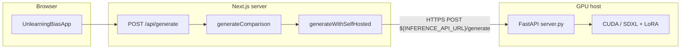

# Architecture

This app has one generation backend: a self-hosted FastAPI server running SDXL on a GPU.

## Request Flow



1. `components/UnlearningBiasApp.tsx` sends the prompt and generation settings to `POST /api/generate`.
2. `app/api/generate/route.ts` validates the request and requires `INFERENCE_API_URL` and `LORA_WEIGHTS_URL`.
3. `lib/generate-comparison/index.ts` always calls `generateWithSelfHosted`.
4. `lib/generate-comparison/self-hosted.ts` posts JSON to `${INFERENCE_API_URL}/generate`.
5. `self-hosted-inference/server.py` loads SDXL, generates the baseline image, loads the LoRA, generates the diverse image, and returns both PNGs as base64 JSON.

## Directory Map

| Path                               | Role                                                                     |
| ---------------------------------- | ------------------------------------------------------------------------ |
| `app/api/generate/route.ts`        | Public app API route, env validation, user-facing error hints            |
| `lib/generate-comparison/`         | Shared request/response types and the self-hosted HTTP client            |
| `self-hosted-inference/`           | FastAPI GPU server package: `server.py`, requirements, setup docs        |
| `components/UnlearningBiasApp.tsx` | Client UI for prompt controls, comparison panels, history, and downloads |

## Environment Contract

The Next.js server requires:

```env
INFERENCE_API_URL=https://YOUR-GPU-API.example.com
LORA_WEIGHTS_URL=https://huggingface.co/you/repo/resolve/main/your-lora.safetensors
INFERENCE_API_NGROK_SKIP_BROWSER_WARNING=1
```

`INFERENCE_API_URL` is the origin only. The app appends `/generate`.

## JSON Contract

Next.js sends this body to the FastAPI server:

```json
{
  "baseline_prompt": "a portrait of a CEO",
  "diverse_prompt": "a portrait of a CEO, div_rep",
  "num_inference_steps": 30,
  "guidance_scale": 7.5,
  "seed": 123,
  "lora_scale": 0.8,
  "lora_weights_url": "https://huggingface.co/you/repo/resolve/main/model.safetensors"
}
```

The FastAPI server returns:

```json
{
  "baseline_image_b64": "...",
  "diverse_image_b64": "...",
  "mime_type": "image/png"
}
```

## Public Hosting Notes

The Next.js app can run on a managed Next host or with `next start` behind a reverse proxy. The GPU server must be reachable from that hosted Next.js server, not just from your laptop. Colab/ngrok works for demos; a persistent GPU machine or cloud GPU endpoint is the better public setup.
